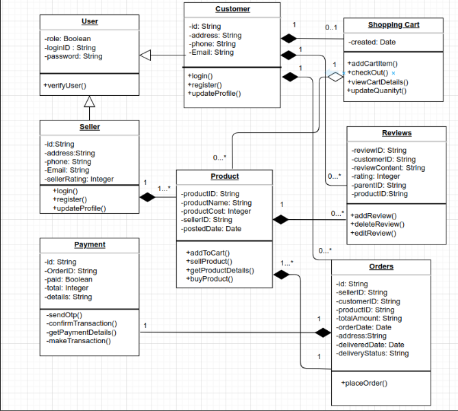

# System Design - Scalable E-commerce Platform

## Overview
This directory includes the system design diagram and description for a large-scale e-commerce platform.

## Architecture Components
- **Frontend**: React application served through CDN for high performance.
- **Backend**: Node.js API hosted on AWS with load balancing.
- **Database**: MySQL with read replicas for scalability.
- **Caching**: Redis caching layer for frequently accessed data.
- **Load Balancer**: AWS ELB for traffic distribution.

## Diagram

## Notes
This design optimizes for scalability, latency, and fault tolerance.

